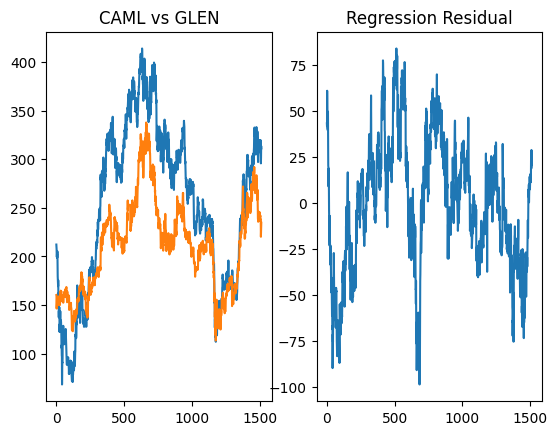
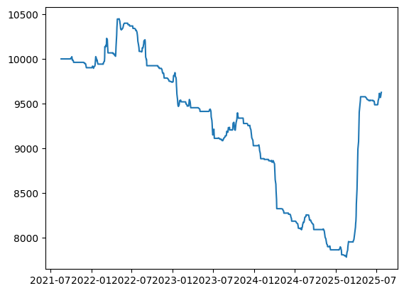

1. Introduction

This repository implements a statistical arbitrage trading strategy based on cointegrated pairs trading. The underlying idea is to identify two stocks 
whose prices move together over time due to an underlying economic or market relationship. When the price spread between the two temporarily diverges 
from its historical mean, the strategy enters a long/short trade to profit from the expected reversion.

The strategy uses historical price data of Glencore PLC (GLEN.L) and Central Asia Metals PLC (CAML.L), both of whom are copper, zinc and lead miners. 
It calculates a hedging ratio via linear regression, tests for cointegration, constructs a mean-reverting spread, and then uses z-score thresholds to 
determine entry and exit points. A backtesting framework simulates trading performance, including P&L tracking and stop-loss management.
    
2. Data Pipeline (data_loader.py)

Price data is sourced from Yahoo Finance using the yfinance library, with a historical window of 10 years of daily data (from today minus 10 years to 
today).

```python
%pip install yfinance
%pip install pandas
```


```python
import yfinance as yf
import pandas as pd
import datetime

def fetch_data():

    glenData = yf.Ticker("GLEN.L")
    camlData = yf.Ticker("CAML.L")

    end_date = datetime.datetime.today().strftime("%Y-%m-%d")
    start_date = (datetime.datetime.today() - datetime.timedelta(days=10*365)).strftime("%Y-%m-%d")

    glenDataDF = pd.DataFrame(glenData.history(start=start_date,end=end_date))
    camlDataDF = pd.DataFrame(camlData.history(start=start_date,end=end_date))

    return glenDataDF,camlDataDF
```
This data is the basis for both training (model calibration) and testing (backtesting) datasets.
    
3. Regression & Hedge Ratio Calculation (pairs_trading.py)

```python
from math import sqrt, log
import matplotlib.pyplot as plt
import statsmodels.tsa.stattools as ts
from sklearn.linear_model import LinearRegression
from scipy.stats import pearsonr

def regress_data(camlDataDF,glenDataDF):

    glenDataDF = pd.DataFrame({'GLEN':glenDataDF["Close"].values})
    camlDataDF = pd.DataFrame({'CAML':camlDataDF["Close"].values})

    data = pd.concat([glenDataDF, camlDataDF], axis=1)
    data.dropna(axis=0, how='any',inplace=True)
    independentStock = 'CAML'
    dependentStock = 'GLEN'

    regressionModel = LinearRegression()
    regressionModel.fit(data[independentStock].values.reshape(-1,1),data[dependentStock].values)
    print('parameters: %.7f, %.7f' %(regressionModel.intercept_, regressionModel.coef_))

    yfit = regressionModel.coef_ * data[independentStock] + regressionModel.intercept_
    y_residual = data[dependentStock] - yfit

    fig, ax = plt.subplots(nrows=1, ncols=2)
    ax[0].set_title(independentStock +' vs ' +dependentStock)
    ax[0].plot(data)
    ax[1].set_title('Regression Residual')
    ax[1].plot(y_residual)

    print(ts.adfuller(y_residual, 1) )

    hedgingRatio = pearsonr(data[independentStock], data[dependentStock])[0]
    print(hedgingRatio)

    plt.show()
    
    return hedgingRatio
```
Here we are using the closing price values for each stock and using OLS regression on them. The prices for CAML have been chosen as the independent variable since that returned the greater cointegration. Looking at the parameters we get that the p-value is circa. 0.09%, far less than the 5% threshold, implying a large cointegration between the two price data. Also from the graph on the left we get a clear visual interpretation that the two prices are highly integrated and closely follow each other. The hedging ratio is what we will use as the constant for calculating the spread in the next section.


4. Trading Logic & Position Management
4.1 Spread Calculation

```python
glenDataDF,camlDataDF = fetch_data()

noOfElements = len(glenDataDF["Close"])
glenTraingDataDF = glenDataDF.iloc[:-1*int(0.4*noOfElements)]
noOfElements = len(camlDataDF["Close"])
camlTraingDataDF = camlDataDF.iloc[:-1*int(0.4*noOfElements)]

hedgingRatio = regress_data(camlTraingDataDF,glenTraingDataDF)
```

    parameters: -93.4351594, 1.6360514
    (-4.165654824378394, 0.0007528777047933718, 1, 1512, {'1%': -3.43468229933681, '5%': -2.8634534376843637, '10%': -2.5677886890239634}, 10580.100526631588)
    0.9085576230206013
    


    

    


```python
from math import log,sqrt

# A is caml B is glen
# For each stock of caml we buy <hedgingRatio> amount of glen
def spread(a,b,hedgingRatio):
    return log(a)-hedgingRatio*log(b)
```
The spread between CAML and GLEN is defined as:

spread=ln⁡(CAML)−hedgingRatio⋅ln⁡(GLEN)

This normalizes prices (log transformation) and adjusts for the hedge ratio.


4.2 Exit Conditions & Stop-Loss Management

```python
def check_positions(positions, hedgingRatio, zScore,prev_zScore, camlTestingDataDF,glenTestingDataDF, x):

    daily_pnl = 0

    for p in positions:

        if p["open"] == True:
            
            if p["type"] == "short":

                pnl_glencore = p["caml_no_of_shares"] * hedgingRatio * (p["buy_price"] - glenTestingDataDF["Close"].iloc[x])
                pnl_caml = p["caml_no_of_shares"] * (camlTestingDataDF["Close"].iloc[x] - p["sell_price"])

                daily_pnl += pnl_glencore + pnl_caml

                if prev_zScore > 0 and zScore <= 0:

                    p["open"] = False

                if zScore >= 2.5 and zScore < 3:

                    p["stop_loss"] = True

                if zScore >= 3 and p["stop_loss"] == True:

                    p["open"] = False


            if p["type"] == "long":

                pnl_glencore = p["caml_no_of_shares"] * hedgingRatio * (glenTestingDataDF["Close"].iloc[x] - p["sell_price"])
                pnl_caml = p["caml_no_of_shares"] * (p["buy_price"] - camlTestingDataDF["Close"].iloc[x])

                daily_pnl += pnl_glencore + pnl_caml

                if zScore >= 0 and prev_zScore < 0:

                    p["open"] = False
    
                if zScore <= -2.5 and zScore > -3:

                    p["stop_loss"] = True

                if zScore <= -3 and p["stop_loss"] == True:

                    p["open"] = False


    return daily_pnl
```
The above function is called every day of trading. Positions are closed when the spread mean-reverts:

Short positions: Exit when z-score crosses below 0.

Long positions: Exit when z-score crosses above 0.

Stop-loss: Activated if z-score moves further against the position beyond ±2.5 and forced exit at ±3 standard deviations if the move continues.


4.3 Daily P&L Calculation 

Computes the profit and loss for all open positions based on price changes in CAML and GLEN.

P&L per position:

Short trade PnL = no. of caml shares * hedging ratio * (glen original buy price - glen current buy price)
+ no. of caml shares * (caml current buy price - caml original buy price)

Long trade PnL = no. of caml shares * hedging ratio * (glen current buy price - glen original buy price)
+ no. of caml shares * (caml original buy price - caml current buy price)


5. Sharpe Ratio

```python
def calculateSharpeRatio(daily_returns,risk_free_daily):

    excess_returns = daily_returns - risk_free_daily
    sharpe_ratio = np.mean(excess_returns) / np.std(excess_returns)
    sharpe_ratio_annualized = sharpe_ratio * np.sqrt(252)

    return sharpe_ratio,sharpe_ratio_annualized
```
The Sharpe Ratio is a formula used to evaluate the risk-adjusted performance of a portfolio. It is defined as

Sharpe Ratio = (return of portfolio - risk-free rate) / standard deviation of the portfolio's excess return

Since we are trading stocks in the British markets, the risk-free rate used is the 3-month Treasury yield of 5.25%. This is divided by 252 to give the daily risk-free rate as we are trading daily and there are 252 trading days in a year. 

```python
import numpy as np

def backtest_strategy(camlTestingDataDF,glenTestingDataDF, hedgingRatio):

    glenTestingDataDF.reset_index(inplace = True)
    camlTestingDataDF.reset_index(inplace = True)

    bankroll = 10000
    prev_zScore = 0
    positions = []
    bankrolls = []
    dates = []

    for x in range(20, min(len(camlTestingDataDF),len(glenTestingDataDF))):

        sumOfSpreads = sum([spread(camlTestingDataDF["Close"].iloc[y], glenTestingDataDF["Close"].iloc[y],hedgingRatio) for y in range(x-20,x)])
        meanSpread = sumOfSpreads/20
        sdSpread = sqrt(sum([(meanSpread-spread(camlTestingDataDF["Close"].iloc[y], glenTestingDataDF["Close"].iloc[y],hedgingRatio))**2 for y in range(x-20,x)]) / 20)
        currentSpread = spread(camlTestingDataDF["Close"].iloc[x], glenTestingDataDF["Close"].iloc[x],hedgingRatio)

        zScore = (currentSpread - meanSpread)/sdSpread

        daily_pnl = check_positions(positions,hedgingRatio, zScore,prev_zScore,camlTestingDataDF,glenTestingDataDF,x)
        bankroll += daily_pnl

        if bankroll > 0:

            if zScore >= 2:
                # short
                # sell A buy B

                stake = bankroll * 0.01
                caml_no_of_shares = stake/camlTestingDataDF["Close"].iloc[x]

                new_position = {"date":glenTestingDataDF['Date'].iloc[x],"type":"short","caml_no_of_shares":caml_no_of_shares, "buy_price":glenTestingDataDF["Close"].iloc[x],"sell_price":camlTestingDataDF["Close"].iloc[x],"open":True,"stop_loss":False}

                positions.append(new_position)

            if zScore <= -2:
                # long
                # buy A sell B
                
                stake = bankroll * 0.01
                caml_no_of_shares = stake/camlTestingDataDF["Close"].iloc[x]

                new_position = {"date":glenTestingDataDF['Date'].iloc[x],"type":"long", "caml_no_of_shares":caml_no_of_shares, "buy_price":camlTestingDataDF["Close"].iloc[x], "sell_price":glenTestingDataDF["Close"].iloc[x],"open":True,"stop_loss":False}

                positions.append(new_position)


        prev_zScore = zScore
        bankrolls.append(bankroll)
        dates.append(glenTestingDataDF["Date"].iloc[x])
        

    initial_bankroll = bankrolls[0]
    final_bankroll = bankrolls[-1]
    
    # Total ROI
    roi = (final_bankroll / initial_bankroll - 1) * 100
    
    # Annualized ROI (CAGR)
    years = 4 * 365 / 365.25
    annual_roi = ((final_bankroll / initial_bankroll) ** (1 / years) - 1) * 100
    
    # Daily returns
    daily_returns = np.array(bankrolls[1:]) / np.array(bankrolls[:-1]) - 1
    
    # Risk-free rate (UK 3M T-bill ~5.25% annually)
    risk_free_annual = 0.0525
    risk_free_daily = risk_free_annual / 252
    
    # Sharpe ratio (annualized)
    sharpe_ratio,sharpe_ratio_annualized = calculateSharpeRatio(daily_returns,risk_free_daily)
    
    # Max Drawdown
    cum_returns = np.array(bankrolls) / initial_bankroll
    running_max = np.maximum.accumulate(cum_returns)
    drawdown = (cum_returns - running_max) / running_max
    max_drawdown = drawdown.min() * 100  # in %
    
    print("=== Strategy Performance Summary ===")
    print(f"Initial Bankroll: £{initial_bankroll:,.2f}")
    print(f"Final Bankroll:   £{final_bankroll:,.2f}")
    print(f"Total ROI:        {roi:.2f}%")
    print(f"Annualized ROI:   {annual_roi:.2f}%")
    print(f"Max Drawdown:     {max_drawdown:.2f}%")
    print(f"Daily Sharpe Ratio: {sharpe_ratio:.2f}")
    print(f"Annualized Sharpe Ratio: {sharpe_ratio_annualized:.2f}")
        
    plt.plot(dates,bankrolls)
    plt.show()
```
6. Z-Score and Entry Conditions

A 20-day rolling window is used to compute the mean spread and standard deviation. The z-score is defined as

z = (x - mean)/standard deviation

where,
x = current spread
z = z-score

When we have a Normal distribution of data points, the z-score creates a new distribution of N(0,1), i.e. a Normal dist. of mean 0 and s.d. 1. This is helpful for easily defining threshold levels, such as 1, 2, or 3 sigmas above the mean.

Now we can define our entry signals:

z ≥ +2: Spread is wider than expected → short CAML, long GLEN
z ≤ -2: Spread is narrower than expected → long CAML, short GLEN

7. Position Sizing

We use 1% of our current bankroll per trade.

```python
noOfElements = len(glenDataDF["Close"])
glenTestingDataDF = glenDataDF.iloc[int(0.6*noOfElements):]
noOfElements = len(camlDataDF["Close"])
camlTestingDataDF = camlDataDF.iloc[int(0.6*noOfElements):]

backtest_strategy(camlTestingDataDF,glenTestingDataDF, hedgingRatio)
```

    === Strategy Performance Summary ===
    Initial Bankroll: £10,000.00
    Final Bankroll:   £9,625.82
    Total ROI:        -3.74%
    Annualized ROI:   -0.95%
    Max Drawdown:     -25.51%
    Daily Sharpe Ratio: -0.11
    Annualized Sharpe Ratio: -1.71
    


    

    

8. Evaluation of results

The model does indeed return a positive total ROI of 18.81%, however this does not indicate future performance. Firstly, the annualized ROI is only 4.41%, which does not beat the stock market benchmark of ~10%. If our goal is to make money we could simply put it into index funds/ETF's that track the stock market and achieve a greater return with much lower risk. The negative daily and annualized Sharpe Ratio's imply that the risk-adjusted performance is very poor, and we could have achieved greater results with a risk-free asset. 


9. Key Assumptions & Limitations

- Pair Selection: Only CAML and GLEN are tested; no automated pair selection.

- Hedging Ratio: Uses correlation coefficient, not regression slope, which may under/over-hedge.

- Stationarity: Assumes stable cointegration; structural breaks can invalidate the model.

- Execution Assumptions:

    - No transaction costs, slippage, or borrowing constraints.

    - Positions fully filled at historical close prices.


10. Potential Improvements

- Hedging Ratio: Use regression slope (ββ) for more accurate hedging.

- Dynamic Thresholds: Optimize z-score entry/exit levels using historical data.

- Expanded Pair Universe: Automatically identify cointegrated pairs via Engle-Granger or Johansen tests.

- Transaction Costs: Incorporate realistic execution costs to evaluate profitability.

- Risk Management: Introduce volatility-based sizing, drawdown limits, and capital allocation rules.

- Live Trading: Integrate with a broker API (e.g., Interactive Brokers) for real-time execution.